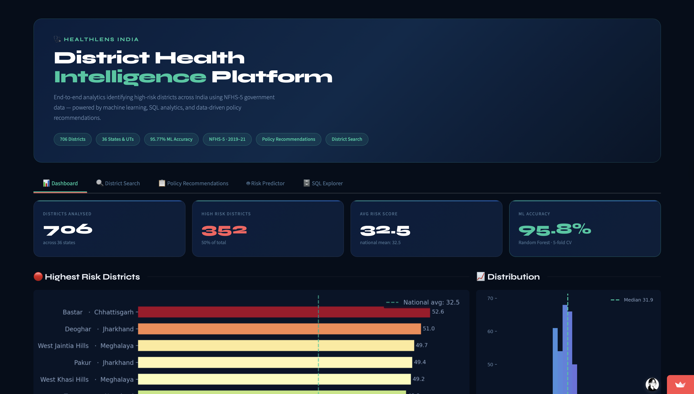
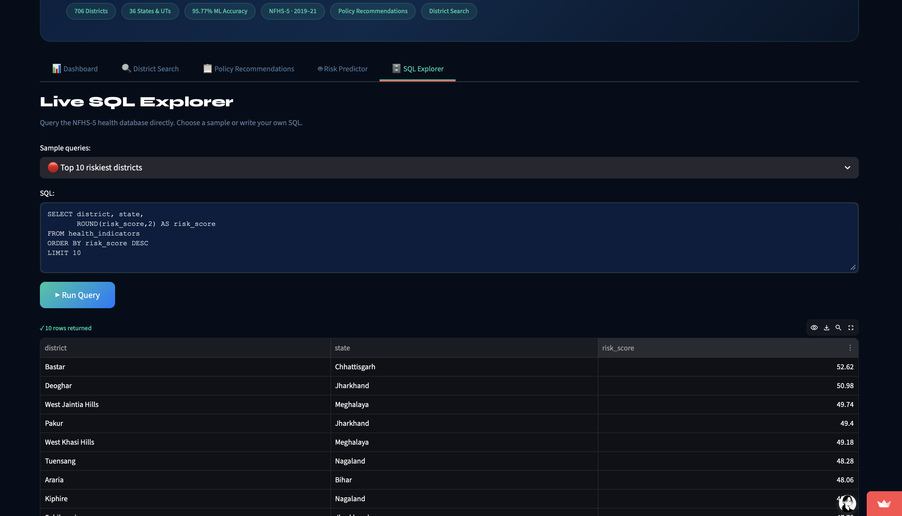
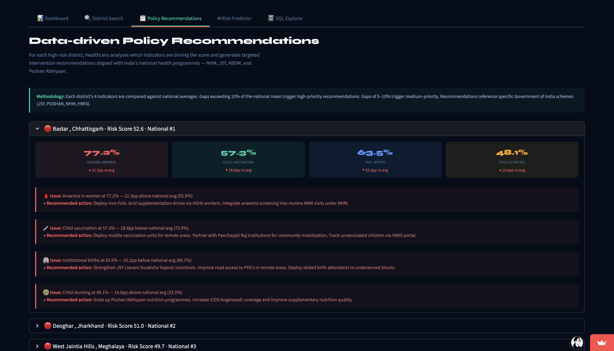

# 🩺 HealthLens India — District Health Intelligence Platform

🔗 **Live App:** https://india-health-intelligence.streamlit.app

---

## ❗ Problem

India’s NFHS-5 dataset contains **100+ health indicators across 706 districts**, but:

* Data is fragmented and difficult to interpret
* No unified risk scoring system exists
* Policymakers lack actionable district-level insights

---

## 🚀 Solution

HealthLens India transforms raw government data into a **decision-support system** that:

* Identifies high-risk districts using a composite risk score
* Predicts risk levels using machine learning
* Generates **policy recommendations aligned with national programs**
* Provides an interactive analytics dashboard

---

## 📊 Key Highlights

* **706 districts analysed**
* **Random Forest ML model — 95.77% accuracy**
* **SQL engine for fast querying**
* **Policy recommendation engine**
* **Deployed Streamlit application**

---

## 🧠 How the System Works

### 1. Data Pipeline

* Source: NFHS-5 (Government of India)
* Cleaning: Missing values handled using median imputation
* Standardization of 100+ indicators

---

### 2. Risk Score Model

Each district is scored using 4 critical indicators:

* Anaemia (Women) → maternal health
* Child Vaccination → preventive care
* Institutional Births → healthcare access
* Child Stunting → long-term nutrition

```text
Risk Score =
0.30 × Anaemia
+ 0.35 × (100 − Vaccination)
+ 0.20 × (100 − Institutional Births)
+ 0.15 × Stunting
```

This creates a **single interpretable metric for district health risk**.

---

### 3. Machine Learning Model

* Model: Random Forest Classifier
* Accuracy: **95.77%**
* Cross-validation: **91.36% ± 2.35%**

**Why Random Forest?**

* Handles non-linear health relationships
* Robust to noisy real-world data
* Works effectively on tabular datasets

---

### 4. Policy Recommendation Engine

The system compares each district against national averages and generates:

* Targeted interventions
* Program-aligned recommendations (NHM, JSY, Poshan Abhiyaan)

This bridges the gap between:
➡️ data → insights → action

---

## 📸 Dashboard Preview

### Main Dashboard


### SQL Explorer


### Policy Recommendations


---

## 📁 Project Structure

```id="struct1"
india-health-intelligence/
│
├── app.py
├── requirements.txt
│
├── data/
│   └── nfhs5_clean.csv
│
├── models/
│   ├── rf_model.pkl
│   └── feature_cols.pkl
│
├── notebooks/
│   └── analysis.ipynb
│
├── charts/
│   ├── chart1_top15.png
│   ├── chart2_correlation.png
│   └── chart3_ml.png
```

---

## 💡 Key Insights

* Bastar (Chhattisgarh) → highest risk district
* Kerala & Tamil Nadu → consistently low risk
* Risk driven primarily by:

  * low vaccination
  * high anaemia
  * poor maternal healthcare access

---

## 🛠️ Tech Stack

* Python (Pandas, NumPy)
* Scikit-learn
* SQLite
* Streamlit
* Matplotlib & Seaborn

---

## ⚙️ Run Locally

```bash id="run1"
git clone https://github.com/aparnaworkspace/india-health-intelligence.git
cd india-health-intelligence
pip install -r requirements.txt
streamlit run app.py
```

---

## 👩‍💻 Author

Aparna Sajeevan
Healthcare Informatics · Machine Learning · Data Analytics
